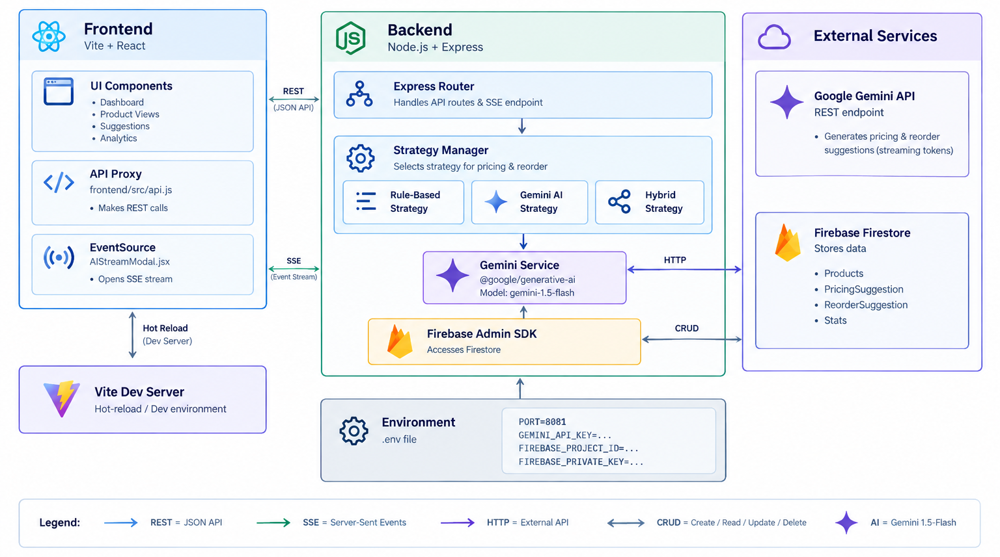
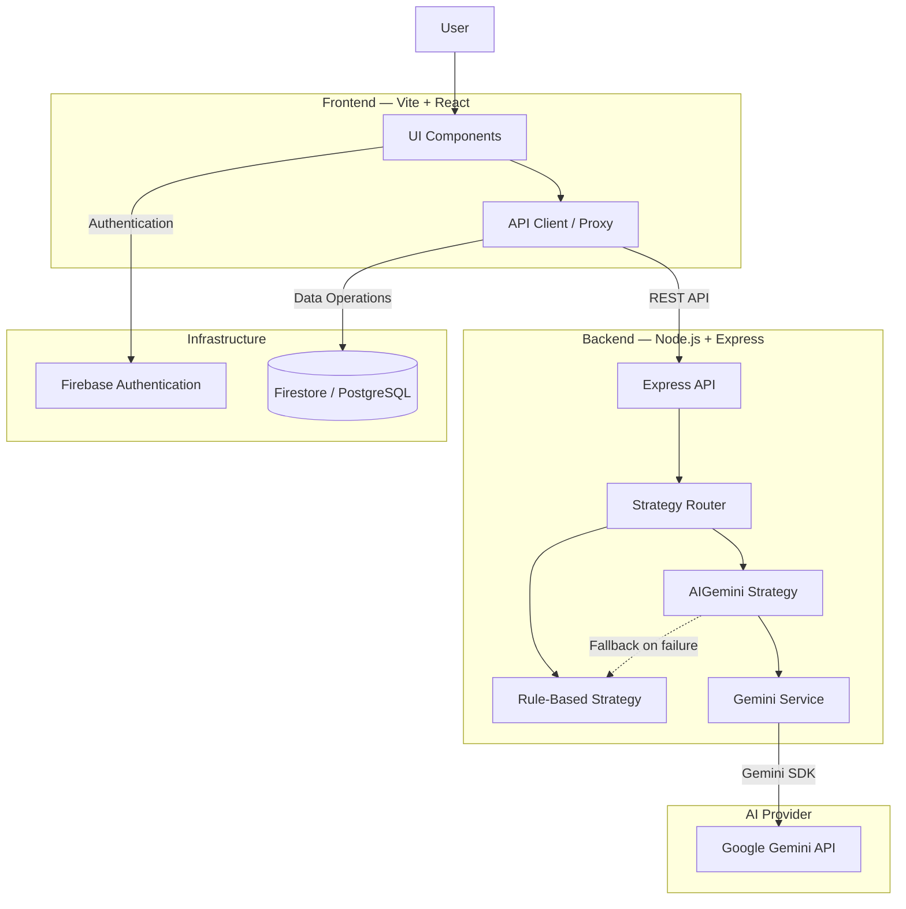
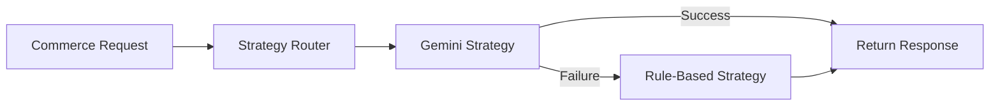

# 📦 Intelligent Commerce Engine

A **hybrid commerce engine** that combines deterministic, rule-based business logic with **Generative AI (Gemini)** to handle intelligent ecommerce decisions, recommendations, and ambiguous use cases.

The system is designed with **reliability, extensibility, and developer experience** in mind. If the Gemini API is unavailable, the engine automatically falls back to deterministic business rules, ensuring the application continues to operate.

---

## 🚀 Overview

The Intelligent Commerce Engine blends traditional ecommerce logic with AI-powered decision-making.

### Core capabilities

* ⚡ **Rule-based business logic** for pricing, discounts, eligibility, and inventory checks
* 🤖 **Gemini-powered AI** for recommendations, product descriptions, and ambiguous requests
* 🔄 **Automatic AI fallback** to deterministic rules when Gemini is unavailable
* 🧩 **Strategy-based architecture** for easily adding new decision-making strategies
* 🎨 **Modern monochrome UI** with a premium SaaS-style interface
* 🚀 **Single-command development workflow**
* 🔐 **Environment-based API key management**
* ♿ **Accessible UI** with high contrast and keyboard-friendly focus states

---

## 🎯 Why This Project Exists

Traditional ecommerce systems rely heavily on deterministic rules:

```text
IF user qualifies
→ Apply discount

IF inventory > 0
→ Allow purchase

IF cart value > threshold
→ Apply promotion
```

These rules are fast and predictable, but they become difficult to maintain when requirements become ambiguous or conversational.

This project introduces a **hybrid approach**:

```text
                User Request
                     │
                     ▼
              Strategy Router
                /          \
               /            \
              ▼              ▼
       Rule-Based          Gemini AI
        Strategy           Strategy
              \              /
               \            /
                ▼          ▼
                 Response
```

The system uses deterministic rules wherever possible and delegates suitable cases to Gemini.

---

# 🏗️ System Architecture





---

# 🧩 Architecture Components

| Component                  | Responsibility                                              |
| -------------------------- | ----------------------------------------------------------- |
| **Vite + React Frontend**  | Provides the user interface and handles user interactions   |
| **API Client / Proxy**     | Sends REST requests from the frontend to the backend        |
| **Express Server**         | Exposes API endpoints and orchestrates application requests |
| **Strategy Router**        | Determines whether a request should use rules or AI         |
| **Rule-Based Strategy**    | Handles deterministic ecommerce business logic              |
| **AI Gemini Strategy**     | Uses Gemini for AI-powered recommendations and decisions    |
| **Gemini Service**         | Provides a thin abstraction around the Gemini SDK           |
| **Firebase Auth**          | Optional authentication layer                               |
| **Firestore / PostgreSQL** | Optional persistence layer                                  |

---

# 🧠 Hybrid Decision Engine

The main idea behind the project is to combine **deterministic logic** with **generative AI**.

### Rule-Based Strategy

Used for predictable business operations such as:

* Product pricing
* Discount eligibility
* Inventory validation
* Promotion rules
* Cart calculations
* Deterministic business constraints

Example:

```text
Cart Value > ₹5,000
        ↓
Eligible for discount
        ↓
Apply 10% discount
```

### Gemini AI Strategy

Used for cases where traditional rules may not be sufficient:

* Product recommendations
* Product description generation
* Natural-language requests
* Ambiguous user intent
* AI-assisted commerce suggestions

Example:

```text
User:
"I need a laptop for coding under ₹70,000"

        ↓

Gemini AI

        ↓

Understand intent
        ↓
Identify requirements
        ↓
Generate recommendation
```

---

# 🔄 Automatic Fallback

Reliability is a key part of the architecture.

If Gemini is unavailable because of:

* Missing API key
* API failure
* Network error
* Rate limiting
* Invalid request
* Service interruption

the system automatically switches to the rule-based strategy.



This prevents an AI service failure from bringing down the entire application.

---

# 🛠️ Tech Stack

## Frontend

* **React**
* **Vite**
* **JavaScript**
* **Vanilla CSS**
* **Inter**
* REST APIs

## Backend

* **Node.js**
* **Express.js**
* **dotenv**
* **@google/generative-ai**

## AI

* **Google Gemini API**

## Infrastructure

* **Firebase Authentication**
* **Firestore**
* **PostgreSQL** *(optional)*

## Development

* **npm**
* **concurrently**
* **ESLint**
* Environment variables

---

# 📂 Project Structure

```text
project/
│
├── backend/
│   ├── src/
│   │   ├── strategies/
│   │   │   ├── RuleBasedStrategy.js
│   │   │   └── AIGeminiStrategy.js
│   │   │
│   │   ├── services/
│   │   │   └── GeminiService.js
│   │   │
│   │   └── server.js
│   │
│   ├── .env.example
│   ├── .env
│   └── package.json
│
├── frontend/
│   ├── src/
│   │   ├── App.jsx
│   │   ├── index.css
│   │   └── api.js
│   │
│   └── package.json
│
├── package.json
└── README.md
```

---

# ⚙️ Getting Started

## 1. Clone the repository

```bash
git clone <repo-url>
cd project
```

## 2. Install dependencies

Install all dependencies from the project root:

```bash
npm install
```

## 3. Configure environment variables

Create the backend environment file:

```bash
cp backend/.env.example backend/.env
```

Add your Gemini API key:

```env
GEMINI_API_KEY=your_api_key_here
```

> Never commit `.env` or expose your API key publicly.

## 4. Start the application

Run both frontend and backend using:

```bash
npm run dev
```

The application will start:

```text
Frontend → http://localhost:5173
Backend  → http://localhost:8080
```

---

# 🔐 Gemini API Key Management

The Gemini API key is stored server-side:

```text
backend/.env
```

Example:

```env
GEMINI_API_KEY=your_api_key_here
```

The frontend never needs direct access to the Gemini API key.

### Runtime Key Swap

The backend can optionally expose an administrative endpoint:

```text
POST /admin/swap-key
```

This allows the Gemini key to be updated without restarting the server.

The endpoint should be protected with an administrative authentication mechanism before being used in production.

---

# 🎨 UI Design

The frontend follows a **minimal black-and-white SaaS aesthetic**.

### Design principles

* Pure black and white palette
* Neutral gray surfaces
* Clean typography
* Inter font
* High contrast
* Minimal visual noise
* Subtle hover animations
* Smooth transitions
* Accessible focus states

Example design direction:

```text
┌──────────────────────────────────────────────┐
│  INTELLIGENT COMMERCE ENGINE                 │
│                                              │
│  ┌────────────────────────────────────────┐  │
│  │ Product / Commerce Request             │  │
│  │                                        │  │
│  │ "Recommend a product for..."           │  │
│  │                                        │  │
│  │                         [ Generate ]    │  │
│  └────────────────────────────────────────┘  │
│                                              │
│  Decision                                    │
│  ──────────────────────────────────────────  │
│  Strategy: Gemini AI                         │
│  Status: Success                             │
└──────────────────────────────────────────────┘
```

---

# 🔌 API Architecture

The frontend communicates with the backend through REST APIs.

Example request flow:

```text
React UI
   │
   ▼
API Client
   │
   ▼
Express API
   │
   ▼
Strategy Router
   │
   ├───────────────┐
   ▼               ▼
Rule Strategy    Gemini Strategy
   │               │
   │               ▼
   │          Gemini API
   │               │
   └───────┬───────┘
           ▼
        Response
           │
           ▼
        React UI
```

---

# 🧪 Example Use Cases

### 1. Discount Eligibility

```text
Input:
Cart value = ₹6,500

Rule Engine:
Cart > ₹5,000

Result:
10% discount eligible
```

### 2. Inventory Validation

```text
Input:
Product stock = 0

Rule Engine:
Stock <= 0

Result:
Product unavailable
```

### 3. AI Product Recommendation

```text
Input:
"I need a laptop for programming under ₹70,000"

Gemini:
Understands the user's intent
→ Extracts requirements
→ Generates recommendations
```

### 4. AI Failure

```text
User Request
     ↓
Gemini API
     ↓
❌ Request Failed
     ↓
Rule-Based Strategy
     ↓
Fallback Response
```

---

# 📈 Design Goals

The architecture is designed around four main principles:

### 1. Reliability

AI should enhance the system, not become a single point of failure.

### 2. Determinism

Business-critical operations should remain predictable and testable.

### 3. Extensibility

New strategies can be added without rewriting the entire application.

```text
Strategy
├── RuleBasedStrategy
├── AIGeminiStrategy
├── RecommendationStrategy
└── FutureStrategy
```

### 4. Developer Experience

The entire development environment can be started with:

```bash
npm run dev
```

---

# 🚀 Future Improvements

Potential extensions include:

* [ ] Product catalog integration
* [ ] Persistent user profiles
* [ ] Advanced recommendation engine
* [ ] Redis caching
* [ ] PostgreSQL product database
* [ ] Analytics dashboard
* [ ] AI response evaluation
* [ ] Request logging and monitoring
* [ ] Rate limiting
* [ ] Role-based admin dashboard
* [ ] Automated testing
* [ ] Docker deployment
* [ ] CI/CD pipeline
* [ ] Production-grade authentication
* [ ] Multiple AI provider support

---

# 🤝 Contributing

Contributions are welcome.

### Development workflow

```bash
# Create a feature branch
git checkout -b feature/your-feature

# Make your changes
git add .

# Commit
git commit -m "Add your feature"

# Push
git push origin feature/your-feature
```

Then open a Pull Request with a clear description of the changes.

---

# 📜 License

This project is licensed under the **MIT License**.

You are free to use, modify, and distribute the project according to the terms of the license.

---


---

## ⭐ Key Takeaway

**AI handles ambiguity. Rules handle certainty. The strategy layer connects both.**

```text
                 INTELLIGENT COMMERCE ENGINE
                           │
                           ▼
                    Strategy Router
                     /           \
                    /             \
                   ▼               ▼
             Rule Engine       Gemini AI
             Deterministic    Generative
                   \               /
                    \             /
                     ▼           ▼
                      Reliable
                       Output
```

---

**Built with React • Node.js • Express • Gemini AI**
